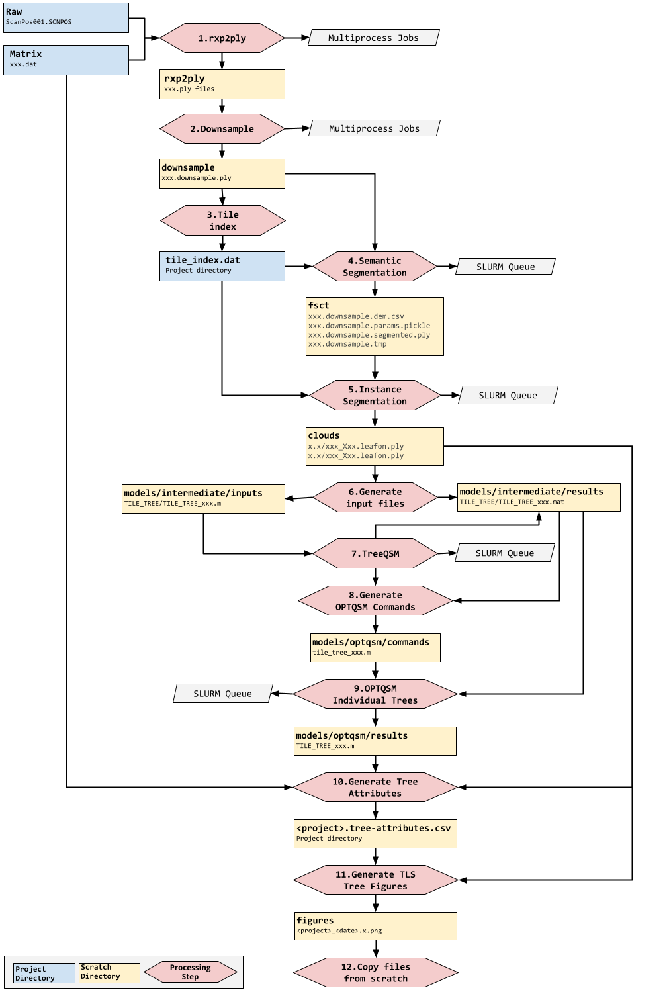

# UCL TLS2trees JASMIN Workflow

## Contents

* [Introduction](#introduction)
* [Process overview](#process-overview)
* [Directory structure](#directory-structure)
* [Data flow](#data-flow)
* [Setup](#setup)
* [Conda environments](#conda-environments)
    + [pdal](#pdal)
    + [pytorch-orchid](#pytorch-orchid)
* [Script execution and monitoring](#script-execution-and-monitoring)
    + [Executing do_xxx scripts](#executing-do-xxx-scripts)
    + [Script order](#script-order)
    + [Logging and monitoring](#logging-and-monitoring)
* [Processing steps](#processing-steps)
    + [Step 1: do_rxp2ply](#step-1--do-rxp2ply)
    + [Step 2: do_downsample](#step-2--do-downsample)
    + [Step 3: do_tile_index {#step-3-do_tile_index}](#step-3--do-tile-index---step-3-do-tile-index-)
    + [Step 4:  Semantic segmentation](#step-4---semantic-segmentation)
    + [Step 5: Instance segmentation](#step-5--instance-segmentation)
    + [Step 6: Generate input files](#step-6--generate-input-files)
    + [Step 7: Run treeQSM](#step-7--run-treeqsm)
    + [Step 8: Generate optqsm command files](#step-8--generate-optqsm-command-files)
    + [Step 9: Run optQSM for individual trees](#step-9--run-optqsm-for-individual-trees)
    + [Step 10: Generate tree-attributes file](#step-10--generate-tree-attributes-file)
    + [Step 11: Generate TLS tree figures](#step-11--generate-tls-tree-figures)
    + [Step 12: Copy scratch directories and files](#step-12--copy-scratch-directories-and-files)


## Introduction
This document describes the preparatory configuration and workflow required to process TLS forest data using TLS2trees, an automated processing pipeline and set of Python command line tools that segments individual trees from plot level point clouds in order to estimate woody volume and above ground biomass (AGB). TLS2trees consists of existing and new methods and is specifically designed to be horizontally scalable. TLS2trees includes three preparatory data steps collectively referred as the **_rxp2ply_** pipeline, followed by two segmentation steps: **_semantic & instance segmentation_**, an **_input generation_** step, three Quantitative Structure Modelling (QSM) steps: **_TreeQSM_**, generate **_optQSM commands_** and **_optQSM_**. Three final steps generate:  1. a **_tree attributes_** .csv file. 2. **_tree figures_** of individually segmented trees, and 3. **_copies result files and directories_** from the scratch to the project directory. Detailed instructions for each of the above-mentioned steps can be accessed via links in the next section - Process overview.  To facilitate improvements to the presented methods as well as modification for other laser scanning modes (e.g. mobile and UAV laser scanning), TLS2trees is a free and open-source software (FOSS). It uses code from the following github repositories:

|Description|Source|
|:----|:----|
|Tools for TLS data processing developed by UCL Geography EO team.|https://github.com/tls-tools-ucl|
|Scripts to make processing simpler to apply|https://github.com/petervines/ucltrees <br> https://github.com/cch-b/ucltrees|

In order to run the process successfully it is necessary to complete the following steps:

1. Setup Conda Environments - see [Conda environments](#conda-environments)
2. Set up directory structure - see [Directory structure](#directory-structure)

A set of bash shell scripts together with process overview and data flow documentation have been developed to simplify the execution of each step in the **_TLS2trees _**processing pipeline and are presented below. Also see the readme file at: [https://github.com/petervines/ucltrees](https://github.com/petervines/ucltrees) for details.

## Process overview

Note: the following conda environments are required to run this process. See [Conda environments](#conda-environments).

|**Stage**|**Description**|**Steps**|
|:----|:----|:----|
|**rxp2ply pipeline**|This 3-step pipeline preprocesses registered .rxp raw files from the Reigl scanner to allow further processing and modelling. <p> <p> The pipeline uses PDAL and requires installation of Python bindings.<p>Follow install and processing instructions at https://github.com/tls-tools-ucl/rxp-pipeline. <p> This 3-step pipeline should generate:<br>1. Tiled (10m) full-resolution xxx.ply files in the rxp2ply scratch directory<br>2. Tiled xxx.downsampled.ply files in the downsample scratch directory <br>3. a tile_index.dat file in the original plot’s directory (not the plot’s scratch directory)|Step 1: Populate the rxp2ply directory <p> <p>Step 2: Downsample data<p> Step 3: Generate the tile index|
|**Semantic segmentation**|Segments tiled point clouds into leaf, wood & ground points|Step 4: Semantic segmentation|
|**Instance segmentation**|Segments tiled point clouds into individual trees within size directories (eg 0.0, 0.1, etc)|Step 5: Instance segmentation|
|**Input files**|Generates input files for all tileID_TreeID.leafon.ply individual tree files (e.g. 007_T1.leafon.ply)  generated in the clouds directory by the previous step|Step 6: Generate input files|
|**TreeQSM**|Submits array job to generate  xxx.mat model candidate files for each individually segmented tree|Step 7: Run TreeQSM|
|**OPTQSM**|This 2-step process first generates xxx.m command files  and then runs these command files to find the optimal QSM model for each individually segmented tree|Step 8: Generate optqsm command files <p> <p> Step 9: Run optqsm for individual trees|
|**Attributes**|Generates a .csv file containing tree attributes for trees inside the plot and some trees on the edges of the plot|Step 10: Generate tree-attributes file|
|**TLS tree figures**|Generates tree figures arranged by size for all plot trees|Step 11: Generate TLS tree figures|
|**Copy files**|Copies result directories and files from scratch to the project directory.|Step 12: Copy scratch directories and files|

## Directory structure 

Directories in _italics_ can be deleted after processing is completed.

Note: if the setup process is followed this structure is created automatically. It can also be created by running make_scratch_dirs. If additional directories are required then make_scratch_dirs can be edited and re-run. This is a non-destructive process.

Base directory is /gws/nopw/j04/nceo_generic/nceo_ucl/TLS/ - you will need to apply for access to the group workspace

```
Country
PLOT
    Project (XXXX-XX-XX.PROJ - original scanner files)
        raw (generated: Reigl scanner)
            ScanPos001.SCNPOS 
            ScanPos002.SCNPOS
            ScanPosXXX.SCNPOS

        matrix (generated in Riscan Pro after registration)
            ScanPos001.DAT (Reigl)
            ScanPos002.DAT
            ScanPosXXX.DAT

        rxp2ply 
            000.ply (full resolution tiled data)
            001.ply
            XXX.ply
            bounding_box (directory containing plot boundary geometry)
            tile_index.dat (file containing the plot's tile index)

        Downsample
            000.downsample.ply
            001.downsample.ply
            XXX.downsample.ply

        Tile_index.dat (final tile index file created as 3rd step of rxp-pipeline)
            fsct
                000.downsample.segmented.ply
                000.downsample.dem.csv
                000.downsample.segmented.pickle
                000.downsample.segmented.tmp

        clouds
            0.0
                000_T0.leafoff.ply
                000_T0.leafon.ply
                XXX_TY.leafoff.ply
                XXX_TY.leafon.ply
            0.1
                X.X

        models
            intermediate
                inputs
                    000_T0
                        000_T0_0.m
                        000_T0_1.m
            results
                000_T0
                    000_T0_0.mat
                    000_T0_1.mat

        optqsm
            commands
                000_T0.m
                000_T1.m
            results
                000_T0.mat
                000_T1.mat
```

## Data flow 

The diagram below describes how data flows through the **_TLS2trees_** processing pipeline



## Setup 

The steps below assume that [https://github.com/tls-tools-ucl](https://github.com/tls-tools-ucl) has been cloned and the setup script has been run. Instructions are given in the repository README.md file.

Setup creates a number of useful aliases and environmental variables.** Note that inter-volume symbolic links are not used as these are not recommended by JASMIN, see [Advice on inter-volume symlinks in JASMIN storage](https://bit.ly/3IwgvzA)**

This setup is run to make navigation easier by creating the following environmental global and project environmental variables and aliases for each project. 

**Global Environmental Variables and Aliases**


|**Environmental Variable**|**Value**|
|:----|:----|
|`$SCRATCH_ROOT`|`/work/scratch-pw3/$USER`|
|`$SCRIPT_DIR`|`/users/$USER/dev/ucltrees/scripts`|
|`$LOG_DIR`|`/users/$USER/dev/ucltrees/logs`|
|**Aliases**|**Action**|
|`cd_scratch`|`cd /work/scratch-pw3/$USER`|
|`cd_scripts`|`cd /users/$USER/dev/ucltrees/scripts`|
|`cd_logs`|`cd /users/$USER/dev/ucltrees/logs`|


**Project Environmental Variables and Aliases**


|**Environmental Variable**|**Value**|
|:----|:----|
|`$<projectID>_path`|`Path to project directory`|
|`$<projectID>_scratch_path`|`Path to scratch project directory`|
|`$<project_logs_path`|`Path to project directory logs`|
|**Aliases**|**Action**|
|`cd_<projectID>`|`cd to project directory`|
|`cd_<projectID>_scratch`|`Cd to project scratch directory`|
|`cd_project_logs`|`Cd to project logs directory`|

## Conda environments 

### pdal

Instructions for compiling pdal and creating  the pdal environment are available here:  [https://github.com/tls-tools-ucl/rxp-pipeline](https://github.com/tls-tools-ucl/rxp-pipeline)

### pytorch-orchid 

**Follow steps below to create pytorch-orchid conda environment:**

**Step 1: access Orchid via the command line:**

Help pages are available at: [https://help.jasmin.ac.uk/article/5068-gpu-cluster-orchid](https://help.jasmin.ac.uk/article/5068-gpu-cluster-orchid)

```
$ srun --gres=gpu:1 --partition=orchid --mem=128000 --account=orchid --pty --time=4:0:0 /bin/bash
```

#### Step 2: build the conda environment

A useful link to generate commands to install torch, torchvision, torchaudio: [https://pytorch.org/get-started/locally](https://pytorch.org/get-started/locally)

```
conda create -n pytorch-orchid python=3.11
conda activate pytorch-orchid
pip install torch torchvision torchaudio
pip install torch-geometric==1.7.2
pip install torch-scatter -f 
https://data.pyg.org/whl/torch-2.1.0+cu121.html
pip install torch-sparse -f 
https://data.pyg.org/whl/torch-2.1.0+cu121.html
pip install torch-cluster -f 
https://data.pyg.org/whl/torch-2.1.0+cu121.html
pip install matplotlib pandas==1.2.5 pandarallel
```

## Script execution and monitoring 

### Executing do_xxx scripts 

Each step of the **_TLS2trees _**processing pipeline  has an associated do_script. 

Scripts are called in the format:

```
$ do_description --proj <projectID>

For example: do_rxp2ply --proj <projectID>
```

By default, all scripts run in the background. If you wish to view them executing interactively, run the script on foreground mode, for example:

```
$ do_rxp2ply --proj <projectID> --mode fg
```

### Script order 

Scripts should be run in the following order:

|**Step**|**Script**|**Description**|
|:----|:----|:----|
|1|do_rxp2ply|Generate ply files|
|2|do_downsample|Downsample the ply files|
|3|do_tile_index|Create a tile index file (tile_index.dat)|
|4|do_semantic_seg|Perform semantic segmentation|
|5|do_instance_seg|Perform instance segmentation|
|6|do_generate_inputs|Generate input files for all tileID_treeID.leafon.ply files generated by the previous step|
|7|do_treeqsm|Run TreeQSM|
|8|do_optqsm_commands|Generate optqsm command files|
|9|do_optqsm|Submit jobs to run optqsm for individual trees|
|10|do_generate_results|Generates tree attributes .csv file|
|11|do_generate_tls_tree_figs|Generates TLS tree figures|
|12|do_copy_files|Copies files from the scratch directories to the project directory|

### Logging and monitoring  

All scripts log progress in $LOG_DIR/&lt;projectID>. 

Each script produces an explicitly named log file, for example: 

STEP01_rxp2ply.log

When a script completes execution _DONE is appended to the file name, for example: STEP01_DONE_rxp2ply.log

A simple way to view progress on all projects under processing is to use the command tree in the $LOG_DIR

Scripts running in the background will monitor the task progress continuously and will update the log file and name when the task is complete.

Tasks queued via sbatch will be monitored, and when complete, their logs will be updated accordingly.

A log of all processing steps is recorded of all processing steps. It includes the project, command, status, start date, completion date and the command executed. This is available in the following locations and formats:


|**Location and file**|**Format**|**Contents**|
|:----|:----|:----|
|~/dev/ucltrees/logs/commands.log|CSV (\|separated)|Log detailing when do_commands were executed and when they completed.|
|~/dev/ucltrees/logs/commands.md|Markdown|Log detailing when do_commands were executed and when they completed in markdown format.|
|~/dev/ucltrees/logs/status.json|JSON|Status of each project and processing stage.|
|~/dev/ucltrees/logs/status.md|Markdown|Status of each project and stage in markdown format.|
|~/dev/ucltrees/logs/status.ipynb|Jupyter Notebook|Status of each project and stage in a Jupyter notebook.|
|~/notebooks/TLS_status.ipynb|Jupyter Notebook|Status of each project and stage in a jupyter notebook, accessible via Jasmin notebook service.|
|~/notebooks/TLS_command_log.ipynb|Jupyter Notebook|Log detailing when do_commands were executed and when they completed in markdown format, accessible via Jasmin notebook service.|

## Processing steps 
In the steps below:

PROJECT_PATH = path in which project directories are held, raw and matrix directories. For example: \
TLS/gabon/OKO-01/2022-06-04.PROJ

SCRATCH_PATH = path in which scratch files are stored, deleted after 28 days. For example: \
/work/scratch-pw3/ucfacc2/


### Step 1: do_rxp2ply  

This step will populate the rxp2ply directory with full resolution 10m<sup>2</sup> tiled data.

**Average execution time**: 1-2 hours

#### Inputs/Outputs

|**Inputs**|**Outputs**|
|:----|:----|
|`--project PROJECT_PATH/raw` <br> path to point clouds of individual scans |`--odir SCRATCH_PATH/rxp2ply`<br> Output directory where 1)full resolution \xxx.ply tile files, 2)a bounding_box directory (contains bounding geometry)) and 3)a tile_index.dat file are saved|
|`--matrix-dir PROJECT_PATH` <br> matrix path to rotation matrices for each scan| |

#### Script

```
$ do_rxp2ply --proj <projectID>
```

#### Generated command example

```
$ python /home/users/ucfacc2/dev/ucltrees/scripts/python/rxp2ply.py 
--project /home/users/ucfacc2/TLS/gabon/OKO-01/2022-06-04.PROJ/raw 
--matrix-dir /home/users/ucfacc2/TLS/gabon/OKO-01/2022-06-04.PROJ/matrix 
--deviation 15 
--tile 10 
--odir /work/scratch-pw3/ucfacc2/oko_01/rxp2ply --reflectance -20 5 --verbose --rotate-bbox 
--save-bounding-geometry /work/scratch-pw3/ucfacc2/oko_01/rxp2ply/bounding_box 
--log-file /home/users/ucfacc2/dev/ucltrees/logs/oko_01/STEP01_generate_ply_files.log --num-prcs 2
```

#### Verification

Numbered files ending in .ply should be created in the rxp2ply directory.

### Step 2: do_downsample 

This step down samples the full resolution 10m<sup>2</sup> tiled xxx.ply files generated by the previous step to a uniform density. 

**Average execution time**: 30 mins - 2 hrs

#### Inputs/Outputs


|**Inputs**|**Outputs**|
|:----|:----|
|`--idir SCRATCH_PATH/rxp2ply `|`--odir SCRATCH_PATH/downsample`<br>Output directory where xxx.downsampled.ply tile files are saved|

#### Script

```
$ do_downsample --proj <projectID>
```
#### Generated command example

```
$ python /home/users/ucfacc2/dev/ucltrees/scripts/python/downsample.py 
--idir /work/scratch-pw3/ucfacc2/oko_01/rxp2ply --odir /work/scratch-pw3/ucfacc2/oko_01/downsample 
--length .02 --verbose
 --log-file /home/users/ucfacc2/dev/ucltrees/logs/oko_01/STEP02_downsample_ply_files.log --num-prcs 2
```

#### Verification

In the project’s SCRATCH_PATH/downloads directory, there should be the same number of xxx.downsample.ply files as in the rxp2ply directory.

### Step 3: do_tile_index {#step-3-do_tile_index}

Generates a tile_index.dat file in the project directory (not the scratch project directory) containing geometry data. 

**Average execution time**: 5 - 10 mins

#### Inputs/Outputs

|**Inputs**|**Outputs**|
|:----|:----|
|`--input  SCRATCH_PATH/downsample`|`--tile_index PROJECT_PATH/tile_index.dat`<br> Output directory where the tile index xxx.dat file is saved|

#### Script

```
$ do_tile_index --proj <projectID>
```
#### Generated command example

```
$ python /home/users/ucfacc2/dev/ucltrees/scripts/python/tile_index.py 
--pc /work/scratch-pw3/ucfacc2/oko_01/downsample 
--tile-index /home/users/ucfacc2/TLS/gabon/OKO-01/2022-06-04.PROJ/tile_index.dat --verbose 
--log-file /home/users/ucfacc2/dev/ucltrees/logs/oko_01/STEP03_tile_index.log
```

#### Verification

Check that a tile_index.dat has been saved in the project path, for example:

 `$ cd_<projectID>`

### Step 4:  Semantic segmentation

Segments tiled point clouds into leaf, wood & ground points.

Access to the Orchid GPU is required, instructions on how to do this are found at: [https://help.jasmin.ac.uk/docs/batch-computing/orchid-gpu-cluster/](https://help.jasmin.ac.uk/docs/batch-computing/orchid-gpu-cluster/)

You will need to create a conda environment on Orchid, see [pytorch-orchid](#pytorch-orchid).

**Average execution time**: 4 - 12 hrs

#### Inputs/Outputs

|**`Inputs`**|**`Outputs`**|
|:----|:----|
|`--input  SCRATCH_PATH/downsample`|`--SCRATCH_PATH/fsct/xxx.downsample.dem.csv`|
|`--array 0-<last tile number>`<br>Defines the range of tiles that sbatch will launch jobs for.|`--SCRATCH_PATH/fsct/xxx.downsample.params.pickle`|
| |`--SCRATCH_PATH/fsct/xxx.downsample.segmented.ply`|
| |`--SCRATCH_PATH/fsct/xxx.downsample.tmp`|

#### Script

```
$ do_semantic_seg --proj <projectID>
```

#### Generated command example

```
$ /usr/bin/sbatch --array=0- --job-name oko_01_semantic_seg --export=ALL,project_dir=/home/users/ucfacc2/TLS/gabon/OKO-01/2022-06-04.PROJ,scratch_dir=/work/scratch-pw3/ucfacc2/oko_01 /home/users/ucfacc2/dev/ucltrees/scripts/jobs/run_fsct_array
```

#### Monitoring 

Check job progress using the command:

```
$ squeue -u <username> | grep <projectID>
```
#### Verification

Check that you have the same number of rxp2ply tiles as you do downsampled tiles

```
$ ls | wc -l
```

### Step 5: Instance segmentation 

Segments the classified tiled point clouds into individual trees within size directories based on tree DBH. These subdirectories are arranged by tree size with the smallest subdirectory 0.0 containing the smallest trees in the plot. 

**Average execution time:** 15-20 hours

#### Inputs/Outputs

|**Inputs**|**Outputs**|
|:----|:----|
|`--input  SCRATCH_PATH/fsct`|`SCRATCH_PATH/clouds/X.X/TILE_TREE.leafon.ply`|
|`--array 0-<last tile number>`<br>Defines the range of tiles that sbatch will launch jobs for.|`SCRATCH_PATH/clouds/X.X/TILE_TREE.leafoff.ply`|

#### Script

```
$ do_instance_seg --proj <projectID>
```
#### Generated command example

```
$ /usr/bin/sbatch --array=0-206 --job-name oko_01_instance_seg --export=ALL,project_dir=/home/users/ucfacc2/TLS/gabon/OKO-01/2022-06-04.PROJ,scratch_dir=/work/scratch-pw3/ucfacc2/oko_01 /home/users/ucfacc2/dev/ucltrees/scripts/jobs/run_points2trees_array
```

#### Check job progress using the command:

```
$ squeue -u <username> | grep <projectID>
```

#### Verification

Once completed, check processing success by copying /gws/nopw/j04/nceo_generic/nceo_ucl/TLS/tools/jupyter/stem_maps.ipynb to your home directory and run via https://notebooks.jasmin.ac.uk/.

You may need to specify your environment by running stem_maps.ipynb  from inside the fsct conda environment.

To check/map the output of the instance segmentation to identify if any tiles were missed and need to be re-run:

Go to Jupiter notebooks in Jasmin, instructions on how to do this is available at: [https://help.jasmin.ac.uk/docs/interactive-computing/jasmin-notebooks-service/](https://help.jasmin.ac.uk/docs/interactive-computing/jasmin-notebooks-service/)

In stem maps.ipynb, update the details for the project being processed in the 5th block of code, for example:

```
 in_dir = '/home/users/ucfacc2/TLS/gabon/OKO-01/2022-06-04.PROJ'
```

If after running the 6th block of code, a list of tiles appears before the tile map, use the list to re-run the instance segmentation on those missed tiles as in STEP 2 and use the list for the array: e.g. sbatch --array=10-80,085,100,126. There is a prompt to enter the array of missed tiles when running do_instance_seg.

If the re-run also misses tiles, copy the missed tiles to the local computer and check them in Cloud Compare to determine why they failed. Instance segmentation failures can be due to a missed tile containing only small trees that cannot be segmented from ground vegetation, lianas can entangle so they cannot be segmented, a tile may contain only sections of trees that were segmented in other tiles, etc. 

### Step 6: Generate input files 

This processing step generates two different types of outputs: 1) input files for all the instance segmentation tileID_treeID.leafon.ply files in the clouds directory and 2)Subdirs to store QSM results will be auto generated under intermediate/results. In this step, subdirectory 0.0 (containing the smallest trees) is also renamed x0.0 and its trees not modelled as they are difficult to separate from ground vegetation.

Under /SCRATCH_PATH/models/intermediate/inputs, a subdir will be generated for each tree, and under each subdirectory, there will be 125 xxx.m files which represent 125 combinations of input parameters for each tree.

Before executing this step, make sure there is a directory structure as shown below. This is required for Steps 6 and 7. This structure was created by the setup process in the project scratch directory.

```
xxxx-xx-xx.project/
    models/
        intermediate/
            inputs/  (a subdir to store input parameters .m files for all trees)
            results/  (a subdir to store TreeQSM result candidates)
        optqsm/
            commands/  (a subdir to store command files to run optqsm, each .m file is a command to run run_opt() for a single tree)
            results/  (a subdir to store the optimal QSM selected from all TreeQSM candidates for each tree)
```

**Average execution time: **15 minutes

#### Inputs/Outputs

|**Input**|**Output**|
|:----|:----|
|`--input  SCRATCH_PATH/clouds`|`SCRATCH/models/intermediate/inputs/TILE_TREE/TILE_TREE_<0-124>.m files for each tree`|
||`SCRATCH/models/intermediate/results/TILE_TREE empty subdirectories to be populated by next step`|

#### Script

```
$ do_generate_inputs --proj <projectID> 
```

#### Generated command example

```
$ python /home/users/ucfacc2/dev/ucltrees/scripts/python/generate_inputs.updated.py 
--input_path /work/scratch-pw3/ucfacc2/oko_01/clouds 
--output_path /work/scratch-pw3/ucfacc2/oko_01/models/intermediate/inputs
```

#### Verification

In each $SCRATCH/models/intermediate/inputs/TILE_TREE/ directory there will be 125 .m files named TILE_TREE_NNN.m where NNN ranges from 0 to 124. An empty  subdirectory for each tree should have been generated in `$SCRATCH/models/intermediate/results`

### Step 7: Run treeQSM

Submits array jobs for the input files (from previous step) and generates up to 621 model candidates (0-620) for each segmented tree.  

**Average execution time**: Up to 7 days

#### Inputs/Outputs

|**Input**|**Output**|
|:----|:----|
|`--input_path $SCRATCH_PATH/models/intermediate/inputs/xxx`|`.mat files` <br>saved in $SCRATCH_PATH/models/intermediate/results`|
||`.m files` in input_path instruct the treeqsm output|

#### Script

```
$ do_treeqsm --proj <projectID> 
```

#### Generated command example

```
$ python /home/users/ucfacc2/dev/ucltrees/scripts/jobs/submit_jobs-run_qsm-array.py 
--input /work/scratch-pw3/ucfacc2/oko_01/models/intermediate/inputs 
--project oko_01 
--job /home/users/ucfacc2/dev/ucltrees/scripts/jobs/run_qsm_array.sh 
--user ucfacc2
```

#### Verification

In each $SCRATCH_PATH/models/intermediate/results/TILE_TREE directory, there will be between 0 and 620 TILE_TREE-xxx.mat files. Some directories may have 0 files.

### Step 8: Generate optqsm command files 

Generates command files to find the optimal QSM from the model candidates for each tree, candidates are under subdirs in models/intermediate/results/. 

Average execution time: 1 minute

#### Inputs/Outputs

|**Input**|**Output**|
|:----|:----|
|`--input_path $SCRATCH_PATH/models/intermediate/inputs`|`--output_path $SCRATCH_PATH/models/optqsm/commands`<br>`xxx.m` files for octave to use.|

#### Script

```
$ do_optqsm_commands --proj <project> 
```

#### Generated command example

```
$ python /gws/nopw/j04/nceo_generic/nceo_ucl/TLS/wx_test/jobs/qsm/job_scripts/generate_optqsm_commands.py  
--input_path /work/scratch-pw3/ucfacc2/oko_01/models/intermediate/results 
--output_path /work/scratch-pw3/ucfacc2/oko_01/models/optqsm/commands 
--verbose
```
#### Verification

There should be xxx.m files in `$SCRATCH_PATH/models/optqsm/results `subdirectories.

### Step 9: Run optQSM for individual trees

Submit jobs to run optQSM for individual trees and find the optimal QSM for each segmented tree.

**Average execution time**: 20-25 minutes

#### Inputs/Outputs

|**Input**|**Output**|
|:----|:----|
|`--input $SCRATCH_PATH/models/optqsm/commands`|`--output $SCRATCH_PATH/models/optqsm/results`|

#### Script

```
$ do_optqsm --proj <projectID> 
```

#### Generated command example

```
$ python /home/users/ucfacc2/dev/ucltrees/scripts/jobs/submit_jobs-run_optqsm-array.py 
--input /work/scratch-pw3/ucfacc2/oko_01/models/optqsm/commands 
--output /work/scratch-pw3/ucfacc2/oko_01/models/optqsm/results 
--project oko_01 
--job /home/users/ucfacc2/dev/ucltrees/scripts/jobs/run_optqsm_array.sh 
--user ucfacc2
```

### Step 10: Generate tree-attributes file 

Generates a .csv report containing the tree attributes (DBH, volume, etc.) for each segmented and modelled tree. Each row in this report represents a tree which can be filtered using the in_plot field/column. Estimates of plot area, AGB & C, total volume + AGB & C ha-1 are saved into the log file for this processing step.

**Average execution tim**e: 10 minutes

#### Inputs/Outputs


|**`Input`**|**`Output`**|
|:----|:----|
|`--clouds $SCRATCH_PATH/clouds`|`--outfile $SCRATCH_PATH/attributes/<projectID>.tree-attributes.csv`|
|`--models $SCRATCH_PATH/models/optqsm/results`||
|`--matrix $PROJECT_PATH/matrix`||


#### Script

```
$ do_generate_results --proj <project>
```

#### Generated command example

```
$ python /home/users/ucfacc2/dev/ucltrees/scripts/python/plot-reports.py --clouds /work/scratch-pw3/ucfacc2/oko_01/clouds/ 
--models /work/scratch-pw3/ucfacc2/oko_01/models/optqsm/results/ 
--matrix /home/users/ucfacc2/TLS/gabon/OKO-01/2022-06-04.PROJ/matrix/ 
--outfile /home/users/ucfacc2/TLS/gabon/OKO-01/2022-06-04.PROJ/oko_01.tree-attributes.csv
```

#### Verification

Results can be checked interactively by copying the jupyter notebook:

gws/nopw/j04/nceo_generic/nceo_ucl/TLS/tools/jupyter/plot-attributes.ipynb to the home directory 

and running via [https://notebooks.jasmin.ac.uk/](https://notebooks.jasmin.ac.uk/).


### Step 11: Generate TLS tree figures 

Generates .png tree figures arranged by tree size (DBH) for all segmented and modelled trees.

**Average execution time**: 20 - 30 minutes

#### Inputs/Outputs

|**Input**|**Output**|
|:----|:----|
|`--cloud_dir $SCRATCH_PATH/clouds`|`--odir $SCRATCH_PATH/figures`|

#### Script

```
$ do_generate_tls_tree_figs  --proj <project>
```
#### Generated command example

```
python /home/users/ucfacc2/dev/ucltrees/scripts/python/tree_figs.py 
--cloud_dir /work/scratch-pw3/ucfacc2/oko_01/clouds/ 
--odir /work/scratch-pw3/ucfacc2/oko_01/figures/ 
--name oko_01_2024-04-22_19-13-58 
--db /home/users/ucfacc2/TLS/gabon/OKO-01/2022-06-04.PROJ/oko_01.tree-attributes.csv --wood-leaf
```

### Step 12: Copy scratch directories and files 

Copies directories generated in scratch back to the project directory. This process uses rsync and is non destructive.

The following directories and their contents are copied: attributes, clouds, downsample, figures, fsct, models, rxp2ply

#### Script

```
$ do_copy_files  --proj <projectID>
```
#### Generated command example

```
 $ /home/users/ucfacc2/dev/github/ucltrees/scripts/copy_files 
--project_path /home/users/ucfacc2/TLS/gabon/OKO-02/2022-06-10.PROJ 
--scratch_path /work/scratch-pw3/ucfacc2/oko_02 
--dirs clouds,downsample,figures,fsct,models,rxp2ply
```